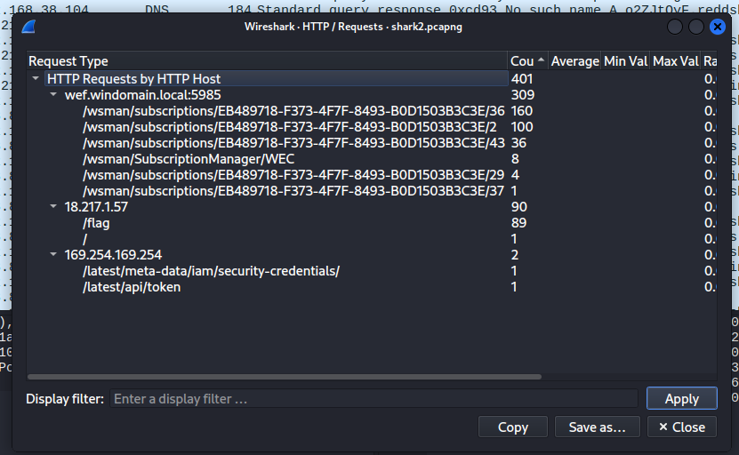

# Bài toán
- Description
    - Can you find the flag?
shark2.pcapng

# Giải
- Đầu tiên dùng statistic (di xuống mục http->requests trong statistics), ta thấy /flag và / trong địa chỉ 18.217.1.57 


- Dùng strings:
```
┌──(kali㉿kali)-[/mnt/hgfs/picoCTF-writeups/Forensics/Wireshark twoo twooo two twoo]
└─$ strings shark2.pcapng | grep "pico"
picoCTF{bfe48e8500c454d647c55a4471985e776a07b26cba64526713f43758599aa98b}
picoCTF{bda69bdf8f570a9aaab0e4108a0fa5f64cb26ba7d2269bb63f68af5d98b98245}
picoCTF{fe83bcb6cfd43d3b79392f6a4232685f6ed4e7a789c2ce559cf3c1ab6adbe34b}
picoCTF{711d3893d90f100c15e10ef4842abeed3a830f8237c1257cd47389646da97810}
...
```
- Ta thấy toàn là fake flag
- filter dns thì thấy rất nhiều dns request đến {sub-domain}.reddshrimpandherring.com

- Nhìn vào thì maybe máy chủ nạn nhân là 192.168.38.104
- Tiếp tục filter http and ip.addr==18.217.1.57 and follow http stream


* Có vẻ là địa chỉ 18.217.1.57 là 1 gợi ý gì đó
- Filter dns and ip.dst==18.217.1.57

* Ta thấy cái sub-domain là một chuỗi base64 -> nối chúng =>Flag
```
┌──(kali㉿kali)-[/mnt/hgfs/picoCTF-writeups/Forensics/Wireshark twoo twooo two twoo]
└─$ tshark -r shark2.pcapng -Y "dns.flags.response == 0 and ip.dst == 18.217.1.57" -T fields -e dns.qry.name | cut -d'.' -f1 | awk '!x[$0]++' | tr -d '\n' | base64 -d
picoCTF{...}           
```
# Note

### 1. Kỹ thuật tấn công: DNS Exfiltration (Tuồn dữ liệu qua DNS)
- **Bản chất:** Trong môi trường thực tế, các hệ thống phòng thủ (Firewall, IDS/IPS) thường kiểm soát rất chặt traffic HTTP/HTTPS nhưng lại bỏ qua hoặc thả lỏng traffic DNS (UDP Port 53) để đảm bảo máy tính luôn phân giải được tên miền.
- **Cách thức hoạt động:** Kẻ tấn công lợi dụng sơ hở này bằng cách biến dữ liệu nhạy cảm (ở đây là Flag) thành các chuỗi mã hóa (Base64), sau đó gắn làm tên miền phụ (Subdomain) và gửi truy vấn DNS đến một máy chủ tên miền độc hại do chúng kiểm soát (`18.217.1.57`). Máy chủ này thực chất không phân giải IP mà chỉ ghi lại nhật ký (Log) các Subdomain gửi đến để thu thập dữ liệu bị đánh cắp.

### 2. Các "Bẫy tâm lý" (Anti-Analysis & Decoy) trong bài
Bài toán này đan xen nhiều kỹ thuật làm nhiễu thông tin mà người phân tích (Forensics) cần tỉnh táo nhận biết:
- **Fake Flags rải rác (Grep/Strings Trap):** Tác giả cố tình rải hàng loạt flag giả dạng hex băm dài trong các gói tin HTTP clear-text. Mục đích là "bẫy" những ai quen thói quen sử dụng lệnh `strings | grep` nhanh nhằm ăn gian điểm mà không thực sự phân tích dòng chảy gói tin.
- **Traffic giả đổ về `8.8.8.8` (Decoy DNS):** Đoạn đầu file PCAP chứa lượng lớn gói tin DNS gửi đến Google DNS (`8.8.8.8`). Khi trích xuất và giải mã đoạn này, kết quả sẽ trả về một file khóa PGP lỗi cấu trúc (`Invalid packet`). Đây là hành vi cố tình tạo nhiễu, làm xáo trộn thứ tự gói tin để tiêu tốn thời gian của người phân tích vào một hướng đi cụ thể nhưng cụt đường.

### 3. Kinh nghiệm rút ra khi làm Forensics Mạng
- Luôn kiểm tra **Protocol Hierarchy** và **HTTP Requests Statistic** đầu tiên để định vị các IP bất thường đứng sau các hành vi lạ (như việc sờ mó vào AWS Metadata `169.254.169.254`).
- Khi thấy traffic DNS xuất hiện các chuỗi ngẫu nhiên dài (High Entropy) lặp đi lặp lại nhắm vào một IP lạ thay vì các DNS Server phổ thông (`8.8.8.8`, `1.1.1.1`), hãy nghi vấn ngay lập tức đến **DNS Tunneling / Exfiltration**.
- Khi trích xuất payload từ gói tin bằng `tshark`, bắt buộc phải lọc chính xác hướng gói tin (`dns.flags.response == 0` hoặc chỉ định cụ thể `ip.dst`) để tránh dữ liệu bị nhân đôi hoặc xáo trộn bởi các gói tin phản hồi trùng lặp (Retransmission).